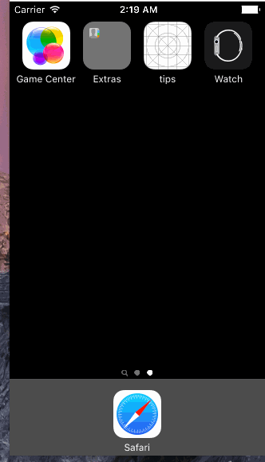
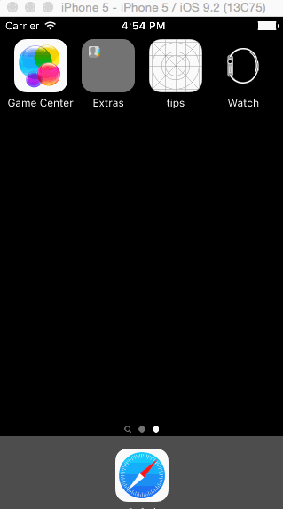
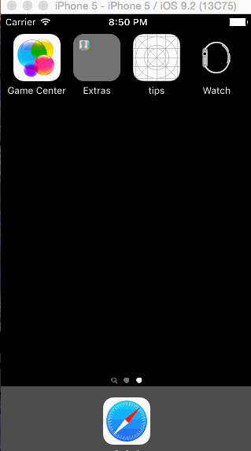

# Pre-work - *a tips calculator application for iOS*

Submitted by: **Kevin Zhu**

Time spent: **4.5** hours spent in total

## User Stories

The following **required** functionality is complete:
* [x] User can enter a bill amount, choose a tip percentage, and see the tip and total values.

The following **optional** features are implemented:
* [x] Custom font
* [x] UI animations
* [x] Making sure the keyboard is always visible and the bill amount is always the first responder. This way the user doesn't have to tap anywhere to use this app. Just launch the app and start typing.

The following **additional** features are implemented:
* [x] Moved everything above the keypad so user can always see everything needed, thus no need to swipe away keypad :)
* [x] Moved percentages up so it's more accessible.
- [ ] List anything else that you can get done to improve the app functionality!

## Video Walkthrough 

Here's a walkthrough of implemented user stories:

V1: 

V2: Added animations, improved UI

V3: Added Split Bill, more animations, improved UI. Final (for now)

GIF created with [LiceCap](http://www.cockos.com/licecap/).

## Notes

Describe any challenges encountered while building the app.
Spent a ton of time not finding that I'd put a linebreak into the code and simulator kept crashing. 
Looked up online resources and got help from classmates for various functions, like keyboard hiding, animation. 

For some reason, I still can't get the "$" to appear in front of Bill Field without throwing error with:  billField.text = String(format: "$%2f", billField.text!) 

## License

    Copyright [yyyy] [name of copyright owner]

    Licensed under the Apache License, Version 2.0 (the "License");
    you may not use this file except in compliance with the License.
    You may obtain a copy of the License at

        http://www.apache.org/licenses/LICENSE-2.0

    Unless required by applicable law or agreed to in writing, software
    distributed under the License is distributed on an "AS IS" BASIS,
    WITHOUT WARRANTIES OR CONDITIONS OF ANY KIND, either express or implied.
    See the License for the specific language governing permissions and
    limitations under the License.
< 1 min to Spreed
